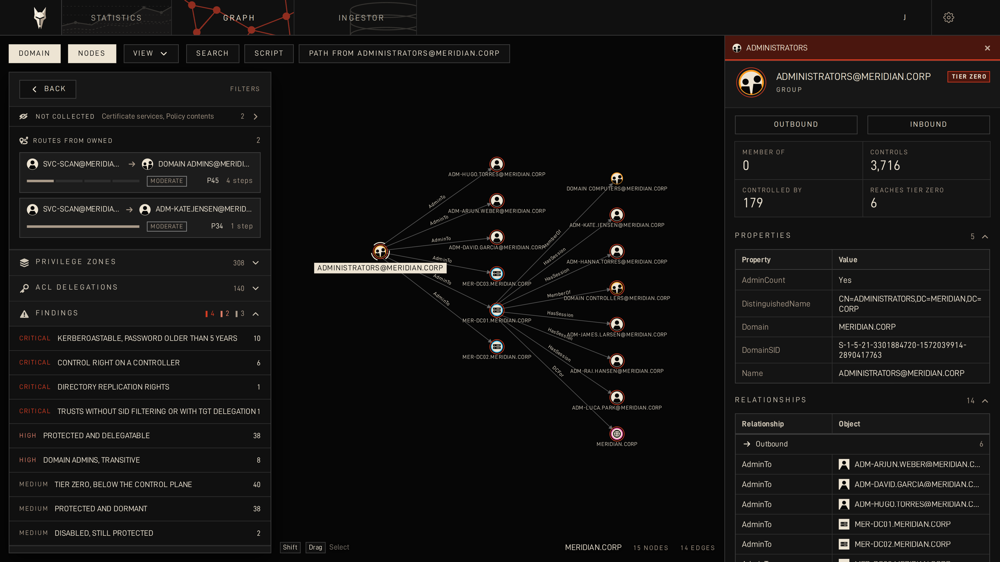

<p align="center"></p>
<h3 align="center">Laelaps</h3>
<p align="center"><i>Know thy domain.</i></p>

<br>

Laelaps is an attack-path analysis console for Active Directory. It ingests
SharpHound and bloodhound-python collections and displays the directory as a
graph. The backend is Swift on Hummingbird over Elasticsearch; the frontend
combines React modules with Palantir's Blueprint, cosmos.gl for the WebGL
graph, and Motion for the details.

Mark as owned an object you have control over, and Laelaps finds the
privilege escalation paths out of it: from that account to control of each
domain, with the technique each step needs. Own another object and the
paths recompute. 

<p align="center"></p>

#### Running

Linux with Docker or Podman. Swift is installed for you if it is missing.

```sh
git clone https://github.com/jydae/laelaps
cd laelaps-ad
./start.sh
```

Open <http://127.0.0.1:8080>, create a project, drop the collector zip on
the Ingestor tab.

#### Roadmap

- Azure support
- CTF integration
- Command(s) and technique description


#### Disclaimer

Laelaps is a security assessment tool. It is for directories you own, for
engagements you have been contracted to carry out, and for training on
data written for the purpose.

Pointing it at a network you do not have written permission to test is
unlawful in most jurisdictions. That permission is yours to obtain and
yours to hold; nothing here grants it, and neither the authors nor the
contributors can be asked to answer for what you do with it.

The software is provided as is, without warranty of any kind. The authors
accept no liability for any damage, loss, disruption or legal consequence
arising from its use or its misuse.

#### License

Apache 2.0. Bundled libraries and fonts are listed in
[THIRD-PARTY-NOTICES.md](THIRD-PARTY-NOTICES.md).
